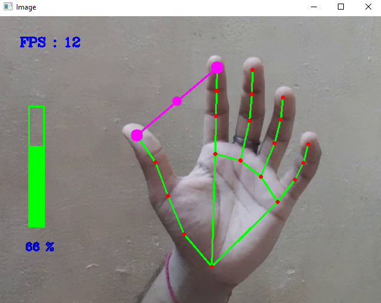

# Welcome to Git-For-Geeks!

Git-For-Geeks in as open source contribution event conducted by Geeks-for-Geeks Chapter of **Shri Ramdeobaba College of Engineering and Management, Nagpur**.

**Make some awesome projects, put them in your directory and create a pull request.**

- Use this project to make your first contribution to an open source project on GitHub. Practice making your first pull request to a public repository before doing the real thing!
- Celebrate Git-For-Geeks by getting involved in the open source community by completing some simple tasks in this project.
- This repository is open to all members who have registered for the Git-For-Geeks Event.

# Hand Gesture Recognition to control volume
## Objective :
Develop a python project which can detect the gesture of a hand in the real time video and control volume of the device using the thumb and the index finger. 
The distance between the index finger tip ad the thumb is proportional to the volume. 
If the distance between the fingers increase the volume should rise and vice-versa.

# **End note**
It's a great privilege of Geeks for Geeks Rcoem. All valid pull request will be accepted, this process may take sometime but don't worry.

**Join our community for more events**

[GFG - Rcoem Chapter](https://linktr.ee/gfgrcoem)

[Instagram](https://www.instagram.com/gfg_rcoem_chapter/)

[LinkedIn](https://www.linkedin.com/company/geeksforgeeks-rcoem-chapter/)

### **Keep smiling 😄**

### **Happy coding 🥳**