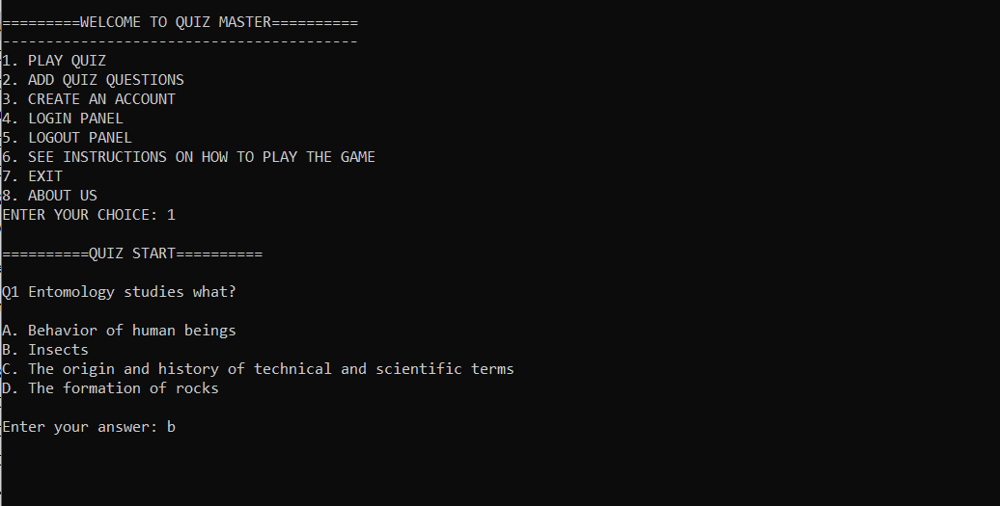

# Welcome to Git-For-Geeks!

Git-For-Geeks in as open source contribution event conducted by Geeks-for-Geeks Chapter of **Shri Ramdeobaba College of Engineering and Management, Nagpur**.

**Make some awesome projects, put them in your directory and create a pull request.**

- Use this project to make your first contribution to an open source project on GitHub. Practice making your first pull request to a public repository before doing the real thing!
- Celebrate Git-For-Geeks by getting involved in the open source community by completing some simple tasks in this project.
- This repository is open to all members who have registered for the Git-For-Geeks Event.

# Build a quiz application with python
## Objective :
Create a basic python quiz application which displays some multiple choice questions, collects the answers and checks whether they are correct or not and display the result. 
Also add one of the following features:
- Make it user friendly by displaying the application somewhere rather than the terminal.
- Add interests by supporting different quiz topics to chose from.
- Keep track of the score and display it in the end.

### Materials:
- [Sending mails with python](https://www.youtube.com/watch?v=BsVQ_cBmEwg&t=83s)

# **End note**
It's a great privilege of Geeks for Geeks Rcoem. All valid pull request will be accepted, this process may take sometime but don't worry.

**Join our community for more events**

[GFG - Rcoem Chapter](https://linktr.ee/gfgrcoem)

[Instagram](https://www.instagram.com/gfg_rcoem_chapter/)

[LinkedIn](https://www.linkedin.com/company/geeksforgeeks-rcoem-chapter/)

### **Keep smiling 😄**

### **Happy coding 🥳**